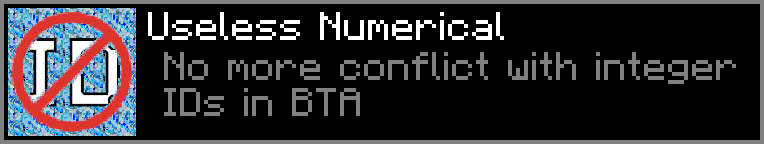

# Useless Numerical

***No more conflict with integer IDs in BTA***

With this mod, you **no longer need to worry** about configuring other mods to avoid block and item ID conflicts.  
It also lets you **detect when a world is missing a block or item** (as long as the world has already been loaded once with this mod).  
Best of all, it is **fully compatible with both client and server**, which makes sharing worlds easy.

### **How does it work?**

The mod **saves, inside each world, a mapping** between BTA’s future **NamespaceID** and its **numeric ID**.  
If a conflict occurs, it **automatically assigns a new numeric ID** to the NamespaceID.

When you **open a save or join a server**, the mod **checks if any blocks or items are missing** and then **verifies whether the ID mapping is correct**.

If the mapping is incorrect, you’ll be **prompted with a button to restart Minecraft**.  
This ensures that your current game and world stays **compatible** without any weird issue.

The big advantage is that it makes **sharing your Minecraft world** with others, or **connecting to a server**, simple and **hassle-free**.

Requirements:

- BTA (https://www.betterthanadventure.net)
- Babric for BTA https://github.com/Turnip-Labs/babric-instance-repo/releases/tag/v7.3_04
